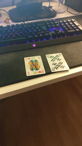

# ENSIS'AR


Ensis'Ar est une application mobile qui utilise la technologie ARcore.
Elle permet de guider les visiteurs de l'école sur le troisième étage.

## Technologie :

Nous avons utilisé ARCORE, Android Studio et Blender.

## Fonctionnalités

* Augmentation d'informations : les noms des salles sont affichées en grand sur une pancarte au dessus des salles.
* Guidage : à l'aide d'une liste déroulante contennant les salles, le visiteur est guidé vers la salle choisie.
* Mini-jeux : les QR-code permettent de lancer des mini-jeux.

## Gestion de projet :

### Déroulement du projet

 Lors de la première après midi, nous avons fait un état de l'art. Nous avons pu observer différentes technologie pour la réalité augmenté comme Arcore, Vuforia, Artoolkit, wikitude, ... Nous avons finalement opter pour Arcore car c'est une des dernière technologie a être développée et donc emporte une large gamme de fonctionalités. Le point négatif de cette technologie est qu'elle nécessite un télephone récent or seulement deux personne du groupe possédait un téléphone compatible. Pour les modèles 3D, blender et unity étaient un choix évident car très performant et gratuit, de plus un membre du groupe avait déjà utilisé les logiciels. Nous avons également choisi Android studio parce que nous sommes tous des utilisateurs android.
 Dans un second temps nous avons établis un plan de route des différentes fonctionnalités que nous allions implémenter. Nous avons aussi créer le Trello et le répertoire Github.

 Les deux jours suivant, nous nous sommes concentrés sur l'apprentissage de nos technologies. Tout le monde c'est familiarisé avec android studio. Laura et Guillem se sont concentrés sur Blender avec l'aide de Maxime. Maxime a experimenté la technologie vuforia avec Unity.
 Vuforia permet simplement de faire la reconnaisance d'image et d'afficher un model 3D par-dessus.

  

 Il ne permet pas de se repérer dans un espace. Nous avons donc abandonné la technologie.

Ceux qui s'occupait de la technologie Arcore on essayé de placer des ancres et des noeuds dans le monde.
Nous avons tenté de placer des coordonnées GPS dans notre monde virtuel. Le problème était la précision, le grand amphi se trouvait au niveau du restaurant universitaire, nous avons donc conclu que ce moyen de positionner les salles n'était pas très précis. C'est pour cela que nous avons choisi de poser les noeuds statiquement.
Nous avons placé la plupart des salles mais lors du démarage de l'application, le monde était mal orienté car le compas du téléphone est assez imprécis. Nous avons donc mis en place une initialisation  en deux points pour pouvoir mettre les éléments 3D dans la bonne direction.

Nous avons aussi eu l'idée commune de créer des mini-jeux. Pour cela nous avons chacun travaillé de notre côté sur nos idées respectives, que nous avons ensuite mises en commun dans la même partie du menu.


Finalement pour permettre un guidage nous avons assigné des voisins à chaque salle.


Par exemple pour la salle E30 nous avons ajouté comme voisin la salle E31 dans le but de faire un système de navigation.


### Répartion des tâches

Modélisateur 3D :

* LONG LAURA
* LOISON GUILLEM
* JUMEAUX MAXIME

Développeur Arcore :
* KURZ FABIEN
* WEBER ARTHUR
* HERR NICOLAS

Directeur artistique & commercial:

* KEBOURI HAMZA


## Fonctionnement :
  Nous avons choisi de poser nos salles statiquement en fonction d'un point de départ. Toutes les salles sont donc placé dès le démarage de l'application. Au démarage de l'application le monde virtuel se génère et une ancre a la position (0,0,0) se place à la position actuelle du téléphone. Pour améliorer l'orientation du monde virtuel nous faisons l'initialisation en deux points.

### Partie Android Studio

#### Menu
  Lors du lancement de l'application, l'interface de démarage est le menu. Celui ci est l'activité principale de l'application. Elle fait le lien avec les autres activités du programme.

#### Visite

##### Intégration des pancartes
 Une fois les modèles 3D réalisés, il faut les ajouter dans l'application. Tous les modèles 3D se trouvent dans le dossier : [models](ENSISAR/app/sampledata/models) au format fbx. Il faut ensuite les convertir en sfb. Il faut rajouter des lignes du type :
 `sceneform.asset('sampledata/models/E30.fbx',
        'src/main/res/raw/e30')`

Celà permet de créer le .sfb dans le dossier raw qui est donc accessible dans le code à l'aide de R.raw. .

Nous avons utilisé l'api [sceneform](https://developers.google.com/ar/develop/java/sceneform/) pour tous les rendus.

Il faut ensuite créer dans le code un objet capable du rendu : un [ModelRenderable](ENSISAR/app/src/main/java/com/example/ensisar/EnsisarVisit.java#L187).
On possède alors un objet 3D. Il nous faut maintenant le placer dans le monde.

Pour celà, on utilise des [nodes](https://developers.google.com/ar/reference/java/sceneform/reference/com/google/ar/sceneform/Node) qui permettent de placer des objets à des positions définies.
Nous avons désactiver les ombres car le rendu était trompeur, et rendait la lecture des pancartes difficile. Voici un extrait de la création de nos noeuds :

``` java
this.node.setParent(parent);
   if (model != null){
        model.setShadowReceiver(false);
        model.setShadowCaster(false);
        this.node.setRenderable(model);
    }
    this.node.setWorldPosition(position);
    this.node.setLocalScale(scale);
    this.node.setWorldRotation(rotation);
```

La créations des objets 3d se fait au contact de l'écran tactile, en effet nous ne pouvons pas les créer à la création du fait de notre calibrage.
Elle se situe donc dans le callback de l'évenement [onTap](ENSISAR/app/src/main/java/com/example/ensisar/EnsisarVisit.java#L366).


##### Guidage

  Dès que quelques salles ont été mise en place, nous nous sommes attaqués à la fonctionalités de guidage. Pour ce faire, toutes les salles sont stockées dans une liste. Chaque salle possède une liste de salles voisines.

  Dès que l'utilisateur choisi une salle dans la liste, l'application va chercher le noeud ou la salle la plus proche et y mettre son point de départ. Elle va ensuite cherché la salle et renvoyer une liste de noeuds pour ce diriger vers celle-ci. Une fois la liste de point acquise, il ne reste plus qu'à tracer des lignes entre les noeuds vers la destination.


#### Mini-jeux

Afin d'apporté une partie ludique à l'application, nous avons ajouté quelques mini-jeux. Pour ne pas perturber la visite, nous avons ajouté au menu une nouvelle partie comprenant les mini-jeux. Ils se déclenchent à l'aide des QR Codes placés dans le batîment.
  
  Dans cette partie du menu, nous avons fait en sorte que dès que la caméra capte un QR Code relié à un mini-jeu, il se lance. Il existe deux types de mini-jeux: "SOS Mario/Peach" et "Tape-Dino". Le premier est un jeu de quête, le joueur doit retrouver dans l'étage Mario et Peach qui se sont fait enlever. Le deuxième consiste à attraper tous les dinosaures apparaissant dans le batîment.

  Ces mini-jeux fonctionnent à l'aide d'ancres placées à partir du point de départ (QR Code scanné) pour l'un, et placées aléatoirement dans une zone définie à partir du point de départ pour l'autre.


## Créateurs

* LONG LAURA
* LOISON GUILLEM
* KURZ FABIEN
* KEBOURI HAMZA
* JUMEAUX MAXIME
* WEBER ARTHUR
* HERR NICOLAS
